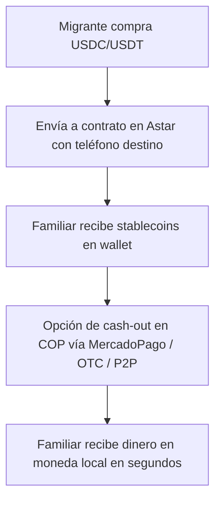

# 🌎 YourExchange – Remesas Instantáneas con Web3


> Democratizando las remesas en Latinoamérica con Astar Network, stablecoins y on/off ramps locales.  
> Sitio oficial 👉 [yourexchange.lat](https://yourexchange.lat)

---

## 📖 Introducción

Millones de migrantes en USA y Europa envían dinero a sus familias en Latinoamérica.  
El sistema tradicional de remesas es:

- Lento ⏳ (puede tardar días).  
- Costoso 💸 (comisiones entre 5% y 12%).  
- Limitado 🌐 (requiere bancos o intermediarios).  

**YourExchange** elimina intermediarios usando **stablecoins en Astar Network** y ofreciendo **cash-out local inmediato en moneda local** a través de integraciones como MercadoPago y P2P.

---

## 🚀 Cómo Funciona

1. 👤 **Migrante** compra USDT/USDC en un exchange de su preferencia (USA/EU).  
2. 📲 Envía el monto al **smart contract de Astar** usando la dirección asociada al número de teléfono del beneficiario.  
3. ⚡ En segundos, el **familiar en Medellín** recibe los fondos en su wallet (USDT/USDC).  
4. 💵 Con un solo clic, el familiar hace **cash-out a pesos colombianos** vía:
   - MercadoPago  
   - OTC / P2P integrados  
   - Aliados locales  

✅ Simple, rápido y seguro.  

---

## 🛠️ Stack Tecnológico

- **Frontend:** [Next.js](https://nextjs.org/)  
- **Backend & DB:** [Supabase](https://supabase.com/) (auth, user data, transaction history)  
- **Blockchain:** [Astar Network](https://astar.network/) + Smart Contracts para mapping de teléfono ↔ wallet  
- **Payments:** [MercadoPago API](https://www.mercadopago.com.co/developers/) para on/off ramp local  
- **Infra:** Netlify para despliegue continuo  

---

## 🗂️ Estructura del Proyecto

```
/your-exchange
 ├── /frontend        # Next.js app (UI/UX)
 ├── /backend         # Supabase + API handlers
 ├── /contracts       # Smart contracts en Astar
 ├── /docs            # Documentación y diagramas
 └── README.md
```

---

## 📊 Diagrama de Flujo



---

## 🧑‍💻 Contribuir

Queremos que **YourExchange** sea un esfuerzo comunitario 💜  
Si eres desarrollador, diseñador o entusiasta de Web3 en LATAM:

1. Haz un fork del repo.  
2. Crea una rama `feature/mi-nueva-funcionalidad`.  
3. Abre un PR explicando tu contribución.  

🙌 Todos los aportes son bienvenidos.  

---

## 🌐 Dominios y Demo

- Sitio oficial: [yourexchange.lat](https://yourexchange.lat)  
- Demo interactiva: _próximamente_  

---

## 📅 Roadmap

- [x] Diseño de arquitectura inicial  
- [x] Smart contract para mapping teléfono → wallet  
- [ ] Integración MercadoPago  
- [ ] UX simplificada (QR / WhatsApp Pay)  
- [ ] Pruebas piloto en Medellín  
- [ ] Expansión a toda Latinoamérica  

---

## 🤝 Agradecimientos

Este proyecto nace en la **Hackathon Web3 Medellín – Aleph/Platohedro**  
con el apoyo de:

- [Astar Network](https://astar.network/)  
- [Platohedro](https://platohedro.org)  
- Comunidad builders de LATAM  

---

## 📜 Licencia

MIT License © 2025 – YourExchange LATAM
